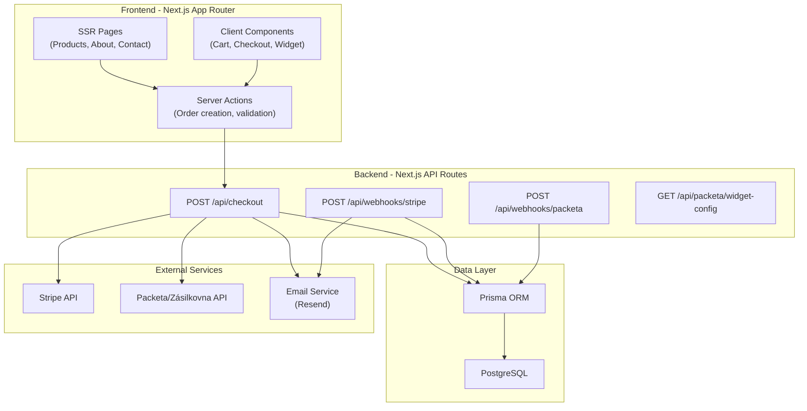
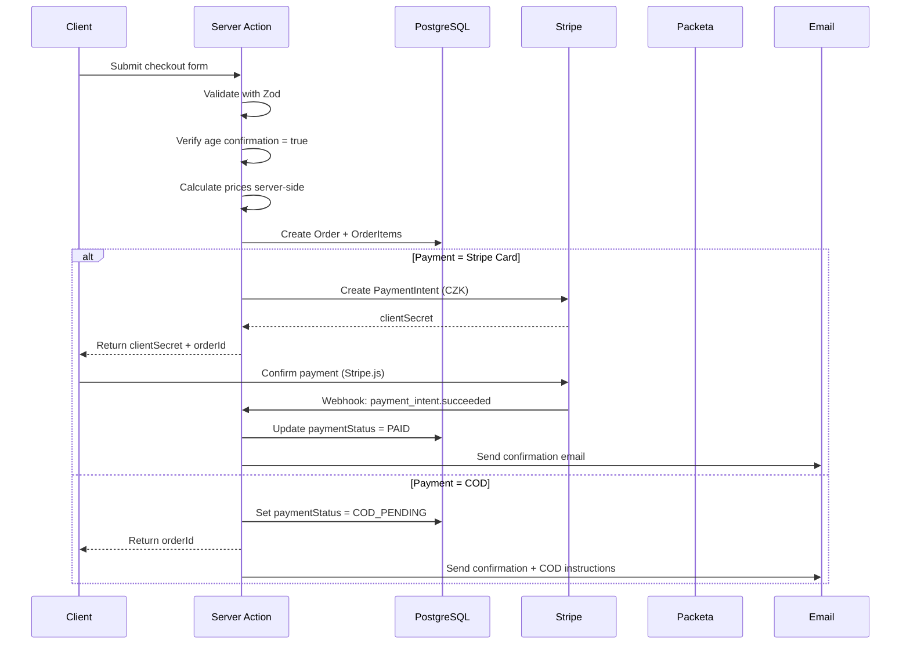
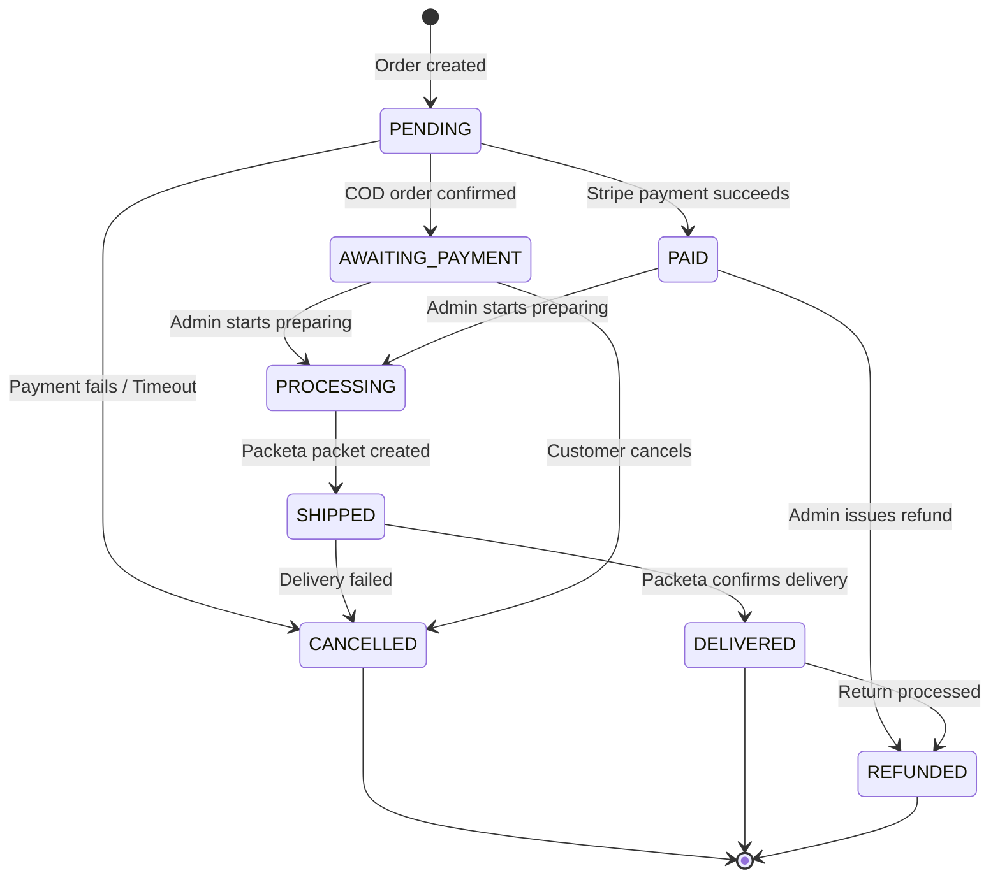
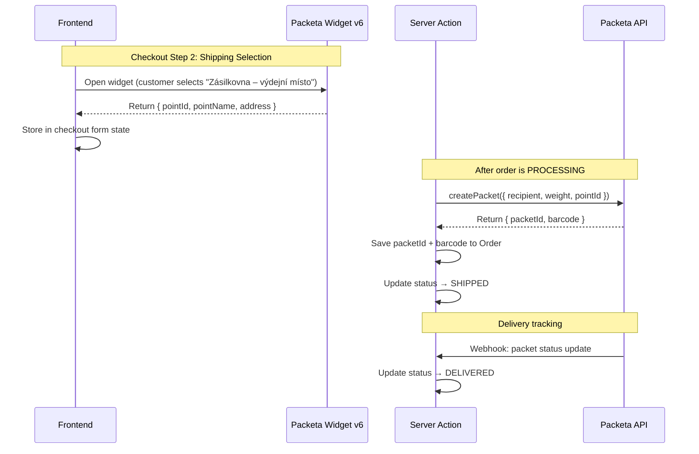
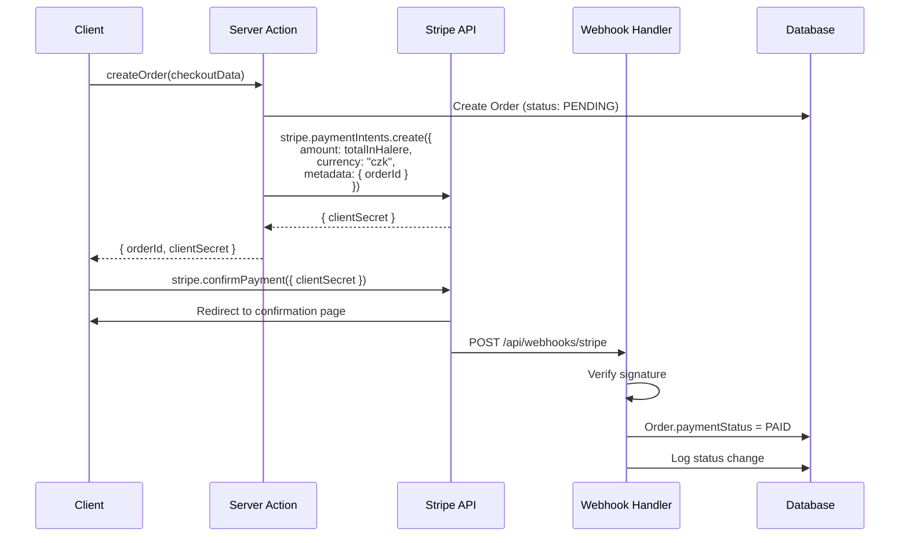
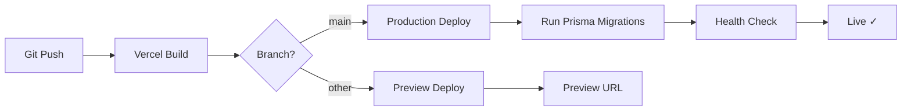

# MoodBox Bloom — Production-Ready Czech E-Commerce Store

## Overview

MoodBox Bloom is a Czech artisan e-commerce store selling handcrafted sweet bouquets (čokokytky) containing chocolate, decorations, and **alcohol** (wine, rum, Jägermeister). The store is operated by sole trader Kateřina Janovská (IČO: 23965878) and must comply with Czech e-commerce law, GDPR, and alcohol sales regulations (Act No. 65/2017 Coll.).

The site will be Czech-language only, CZK currency, targeting the Czech market with Prague local delivery and nationwide Packeta/Zásilkovna shipping.

---

## Pre-Implementation Issues Discovered

> [!WARNING]
> **Missing product image**: The `magic_bloom` product image is **not present** in `/public`. Only 4 of 5 product images exist. We need the image before implementing the product catalog.

> [!WARNING]
> **Filenames with trailing spaces**: `blue_dream .png`, `pink_edition .png`, and `red_passion .png` have trailing spaces before the extension. These will cause issues with URLs and imports. We should rename them during setup.

> [!IMPORTANT]
> **Payment method discrepancy**: The README specifies "Bankovní převod" (bank transfer) + "Dobírka" (COD), but the user request says "Stripe and cash on delivery." I will architect for **Stripe card payments** (replacing bank transfer) + **COD (+30 Kč)** as specified. Please confirm this is correct.

---

## Open Questions

1. **Missing Magic Bloom image** — Can you provide the `magic_bloom.png` product photo?
2. **Stripe vs Bank Transfer** — Do you want Stripe (card payments) to replace "Bankovní převod" entirely, or should we support bank transfer as well (Stripe supports Czech bank transfers)?
3. **Admin panel** — Do you need an admin dashboard for order management, or will you manage orders via Stripe Dashboard + email notifications initially?
4. **Custom orders** — The README mentions "každá kytice může být upravena na přání" (each bouquet can be customized). Should there be a customization/note field during checkout?
5. **Free Prague delivery** — How is Prague delivery fulfilled? Personal delivery by the owner? Does the customer select an address, and you deliver directly?
6. **Inventory management** — Are products always in stock (made to order), or do you need stock tracking?
7. **Domain and hosting** — Do you have a domain and Vercel account ready, or should we plan for that?

---

## 1. Recommended Architecture

### High-Level Architecture



### Architectural Principles

| Principle | Implementation |
|---|---|
| **Server-first rendering** | All product/content pages are Server Components (SSR/SSG) |
| **Client islands** | Only Cart, Checkout form, Packeta widget, Stripe Elements are Client Components |
| **Server Actions** | Order creation, validation, cart operations via Server Actions |
| **API Routes** | Only for webhook receivers (Stripe, Packeta) and external widget configs |
| **Type safety end-to-end** | Zod schemas shared between client validation, server actions, and API |
| **Static product data** | Products defined in code (no CMS needed for 5 products) |
| **Session-based cart** | Cart stored in `localStorage` + React Context (no auth needed for cart) |

---

## 2. Folder Structure

```
moodbox/
├── app/
│   ├── layout.tsx                    # Root layout (fonts, metadata, providers)
│   ├── page.tsx                      # Homepage (hero, featured products)
│   ├── globals.css                   # Tailwind + MoodBox design tokens
│   │
│   ├── produkty/
│   │   ├── page.tsx                  # Product listing page
│   │   └── [slug]/
│   │       └── page.tsx              # Product detail page
│   │
│   ├── kosik/
│   │   └── page.tsx                  # Cart page
│   │
│   ├── pokladna/
│   │   └── page.tsx                  # Checkout page (multi-step)
│   │
│   ├── objednavka/
│   │   ├── potvrzeni/
│   │   │   └── page.tsx              # Order confirmation (success)
│   │   └── [id]/
│   │       └── page.tsx              # Order status/tracking page
│   │
│   ├── o-nas/
│   │   └── page.tsx                  # About us page
│   │
│   ├── kontakt/
│   │   └── page.tsx                  # Contact page
│   │
│   ├── obchodni-podminky/
│   │   └── page.tsx                  # Terms & conditions
│   │
│   ├── ochrana-udaju/
│   │   └── page.tsx                  # Privacy policy (GDPR)
│   │
│   ├── reklamace/
│   │   └── page.tsx                  # Complaints/returns info
│   │
│   └── api/
│       ├── checkout/
│       │   └── route.ts              # Create order + Stripe PaymentIntent
│       ├── webhooks/
│       │   ├── stripe/
│       │   │   └── route.ts          # Stripe webhook handler
│       │   └── packeta/
│       │       └── route.ts          # Packeta status webhook
│       └── orders/
│           └── [id]/
│               └── route.ts          # Order status API (for tracking)
│
├── components/
│   ├── ui/                           # Reusable UI primitives
│   │   ├── button.tsx
│   │   ├── input.tsx
│   │   ├── badge.tsx
│   │   ├── card.tsx
│   │   ├── checkbox.tsx
│   │   ├── select.tsx
│   │   ├── toast.tsx
│   │   └── loading-spinner.tsx
│   │
│   ├── layout/                       # Layout components
│   │   ├── header.tsx
│   │   ├── footer.tsx
│   │   ├── nav.tsx
│   │   └── mobile-nav.tsx
│   │
│   ├── product/                      # Product-related components
│   │   ├── product-card.tsx
│   │   ├── product-grid.tsx
│   │   ├── product-detail.tsx
│   │   └── product-gallery.tsx
│   │
│   ├── cart/                         # Cart components
│   │   ├── cart-provider.tsx          # Cart context + localStorage
│   │   ├── cart-icon.tsx              # Header cart icon with badge
│   │   ├── cart-drawer.tsx            # Slide-out cart drawer
│   │   ├── cart-item.tsx
│   │   └── cart-summary.tsx
│   │
│   ├── checkout/                     # Checkout components
│   │   ├── checkout-form.tsx          # Multi-step checkout form
│   │   ├── contact-step.tsx           # Step 1: Contact info
│   │   ├── shipping-step.tsx          # Step 2: Shipping method + address
│   │   ├── payment-step.tsx           # Step 3: Payment method
│   │   ├── review-step.tsx            # Step 4: Review + age confirmation
│   │   ├── packeta-widget.tsx         # Packeta pickup point selector
│   │   ├── stripe-payment.tsx         # Stripe Elements wrapper
│   │   ├── age-verification.tsx       # 18+ checkbox component
│   │   └── order-summary-sidebar.tsx  # Sticky order summary
│   │
│   └── shared/                       # Shared/common components
│       ├── hero-section.tsx
│       ├── age-gate-modal.tsx         # Entry age-gate (18+)
│       ├── cookie-consent.tsx         # GDPR cookie banner
│       ├── seo-head.tsx
│       └── whatsapp-button.tsx        # Floating contact button
│
├── lib/
│   ├── db.ts                         # Prisma client singleton
│   ├── stripe.ts                     # Stripe client singleton
│   ├── packeta.ts                    # Packeta API client
│   ├── email.ts                      # Email service (Resend)
│   ├── utils.ts                      # General utilities
│   ├── format.ts                     # CZK formatting, date formatting
│   └── constants.ts                  # App-wide constants
│
├── data/
│   ├── products.ts                   # Product catalog (static data)
│   └── shipping.ts                   # Shipping methods + prices
│
├── schemas/
│   ├── checkout.ts                   # Checkout form Zod schemas
│   ├── order.ts                      # Order validation schemas
│   └── contact.ts                    # Contact form schemas
│
├── types/
│   ├── product.ts                    # Product types
│   ├── cart.ts                       # Cart types
│   ├── order.ts                      # Order types
│   ├── shipping.ts                   # Shipping types
│   └── packeta.ts                    # Packeta API types
│
├── hooks/
│   ├── use-cart.ts                   # Cart hook (from context)
│   ├── use-checkout.ts               # Checkout state management
│   └── use-local-storage.ts          # localStorage hook
│
├── actions/
│   ├── create-order.ts               # Server Action: create order
│   ├── validate-checkout.ts          # Server Action: validate form
│   └── get-order-status.ts           # Server Action: get order status
│
├── emails/
│   ├── order-confirmation.tsx        # Order confirmation email template
│   ├── order-shipped.tsx             # Shipping notification email
│   └── order-cod-instructions.tsx    # COD-specific instructions
│
├── prisma/
│   ├── schema.prisma                 # Database schema
│   ├── seed.ts                       # Seed script (optional)
│   └── migrations/                   # Migration files
│
├── public/
│   ├── logo.png                      # MoodBox logo
│   ├── products/                     # Product images (renamed, organized)
│   │   ├── pink-edition.png
│   │   ├── red-passion.png
│   │   ├── blue-dream.png
│   │   ├── magic-bloom.png           # ⚠️ NEEDED
│   │   └── golden-elegance.png
│   ├── og-image.png                  # Open Graph social share image
│   └── favicon.ico
│
├── .env.local                        # Environment variables (gitignored)
├── .env.example                      # Environment variables template
├── middleware.ts                      # Next.js middleware (rate limiting, CSP)
├── next.config.ts
├── tailwind.config.ts                # Tailwind v4 - may be in CSS
├── package.json
├── prisma/schema.prisma
└── tsconfig.json
```

---

## 3. Database Schema (Prisma)

```prisma
generator client {
  provider = "prisma-client-js"
}

datasource db {
  provider = "postgresql"
  url      = env("DATABASE_URL")
}

// ─── Orders ────────────────────────────────────────────────────────

model Order {
  id              String        @id @default(cuid())
  orderNumber     String        @unique          // e.g., "MB-2026-00001"
  status          OrderStatus   @default(PENDING)
  
  // Customer info (no user accounts)
  email           String
  phone           String
  firstName       String
  lastName        String
  
  // Billing address (required for Czech law)
  billingStreet   String
  billingCity     String
  billingZip      String
  billingCountry  String        @default("CZ")
  
  // Shipping
  shippingMethod  ShippingMethod
  
  // For Packeta pickup point
  packetaPointId  String?
  packetaPointName String?
  
  // For address delivery (Packeta or Prague)
  shippingStreet  String?
  shippingCity    String?
  shippingZip     String?
  
  // Pricing (all in CZK, stored as integers = haléře)
  subtotal        Int                            // Product total in haléře
  shippingPrice   Int                            // Shipping cost in haléře
  codFee          Int           @default(0)      // COD surcharge in haléře
  totalPrice      Int                            // Grand total in haléře
  
  // Payment
  paymentMethod   PaymentMethod
  paymentStatus   PaymentStatus @default(PENDING)
  stripePaymentId String?       @unique
  
  // Packeta tracking
  packetaPacketId String?       @unique
  packetaBarcode  String?
  trackingUrl     String?
  
  // Age verification
  ageVerified     Boolean       @default(false)  // Must be true
  
  // Customer note
  note            String?
  
  // Timestamps
  createdAt       DateTime      @default(now())
  updatedAt       DateTime      @updatedAt
  paidAt          DateTime?
  shippedAt       DateTime?
  deliveredAt     DateTime?
  cancelledAt     DateTime?
  
  // Relations
  items           OrderItem[]
  statusHistory   OrderStatusLog[]
  
  @@index([email])
  @@index([orderNumber])
  @@index([status])
  @@index([createdAt])
}

model OrderItem {
  id          String   @id @default(cuid())
  orderId     String
  order       Order    @relation(fields: [orderId], references: [id], onDelete: Cascade)
  
  productSlug String                            // References static product data
  productName String                            // Snapshot at time of order
  quantity    Int
  unitPrice   Int                               // Price in haléře at time of order
  totalPrice  Int                               // quantity * unitPrice
  
  createdAt   DateTime @default(now())
  
  @@index([orderId])
}

model OrderStatusLog {
  id        String      @id @default(cuid())
  orderId   String
  order     Order       @relation(fields: [orderId], references: [id], onDelete: Cascade)
  
  fromStatus OrderStatus?
  toStatus   OrderStatus
  note       String?
  source     String      @default("system")     // "system", "admin", "stripe", "packeta"
  
  createdAt  DateTime    @default(now())
  
  @@index([orderId])
}

// ─── Enums ─────────────────────────────────────────────────────────

enum OrderStatus {
  PENDING           // Order created, awaiting payment
  AWAITING_PAYMENT  // For COD: waiting for payment on delivery
  PAID              // Payment confirmed
  PROCESSING        // Being prepared
  SHIPPED           // Handed to Packeta / out for delivery
  DELIVERED         // Confirmed delivered
  CANCELLED         // Cancelled by customer or admin
  REFUNDED          // Payment refunded
}

enum ShippingMethod {
  PRAGUE_DELIVERY   // Free Prague delivery
  PACKETA_PICKUP    // Zásilkovna pickup point (89 Kč)
  PACKETA_ADDRESS   // Zásilkovna address delivery (129 Kč)
}

enum PaymentMethod {
  STRIPE_CARD       // Stripe card payment
  COD               // Cash on delivery (dobírka, +30 Kč)
}

enum PaymentStatus {
  PENDING           // Not yet paid
  PROCESSING        // Payment in progress
  PAID              // Successfully paid
  FAILED            // Payment failed
  REFUNDED          // Payment refunded
  COD_PENDING       // COD: payment expected on delivery
  COD_COLLECTED     // COD: payment collected
}
```

### Schema Design Decisions

- **No User/Account model** — Guest checkout only (small artisan shop, no need for accounts)
- **Prices stored in haléře** (CZK cents) — Avoids floating-point issues, consistent with Stripe
- **Product data is NOT in DB** — 5 static products defined in code; product snapshots (name, price) are stored in `OrderItem` for historical accuracy
- **CUID IDs** — URL-safe, globally unique, non-sequential (security)
- **Status audit log** — Full traceability for every status change

---

## 4. API Design

### Server Actions (Primary Interface)

| Action | Purpose | Input Schema |
|---|---|---|
| `createOrder` | Validate checkout data, create order, initiate payment | `CheckoutFormSchema` |
| `getOrderStatus` | Fetch order status for confirmation/tracking page | `{ orderId: string }` |

### API Routes (Webhooks Only)

| Endpoint | Method | Purpose |
|---|---|---|
| `/api/webhooks/stripe` | `POST` | Handle Stripe events (`payment_intent.succeeded`, `payment_intent.payment_failed`) |
| `/api/webhooks/packeta` | `POST` | Handle Packeta shipment status updates |
| `/api/orders/[id]` | `GET` | Public order status lookup (by order ID) |

### Server Action: `createOrder` Flow



---

## 5. Checkout Flow

### Multi-Step Checkout (Single Page, No Navigation)

```
┌─────────────────────────────────────────────────────────┐
│  Step 1: KONTAKTNÍ ÚDAJE (Contact Info)                 │
│  ┌───────────────────┐ ┌───────────────────┐            │
│  │ Jméno             │ │ Příjmení          │            │
│  └───────────────────┘ └───────────────────┘            │
│  ┌───────────────────┐ ┌───────────────────┐            │
│  │ Email             │ │ Telefon           │            │
│  └───────────────────┘ └───────────────────┘            │
│  ┌──────────────────────────────────────────┐           │
│  │ Fakturační adresa (ulice, město, PSČ)    │           │
│  └──────────────────────────────────────────┘           │
├─────────────────────────────────────────────────────────┤
│  Step 2: DOPRAVA (Shipping)                             │
│  ○ Doručení po Praze — ZDARMA                           │
│     └─ [Adresa doručení]                                │
│  ○ Zásilkovna – výdejní místo — 89 Kč                  │
│     └─ [Packeta Widget: Vybrat výdejní místo]           │
│  ○ Zásilkovna – na adresu — 129 Kč                     │
│     └─ [Adresa doručení]                                │
├─────────────────────────────────────────────────────────┤
│  Step 3: PLATBA (Payment)                               │
│  ○ Kartou online (Visa, Mastercard)                     │
│  ○ Dobírka (+30 Kč)                                     │
├─────────────────────────────────────────────────────────┤
│  Step 4: SHRNUTÍ A POTVRZENÍ (Review)                   │
│  ┌──────────────────────────────────────────┐           │
│  │ Order summary table                       │           │
│  │ Subtotal: 999 Kč                          │           │
│  │ Doprava:   89 Kč                          │           │
│  │ Dobírka:   30 Kč                          │           │
│  │ CELKEM: 1 118 Kč                          │           │
│  └──────────────────────────────────────────┘           │
│  ☑ Potvrzuji, že je mi 18 let ← REQUIRED               │
│  ☑ Souhlasím s obchodními podmínkami ← REQUIRED         │
│  ☑ Souhlasím se zpracováním os. údajů ← REQUIRED       │
│  ┌──────────────────────────────────────────┐           │
│  │ Poznámka k objednávce (optional)          │           │
│  └──────────────────────────────────────────┘           │
│                                                         │
│  [  ODESLAT OBJEDNÁVKU  ]                               │
└─────────────────────────────────────────────────────────┘
```

### Zod Validation Schema (Checkout)

```typescript
const CheckoutSchema = z.object({
  // Contact
  firstName: z.string().min(2, "Jméno je povinné"),
  lastName: z.string().min(2, "Příjmení je povinné"),
  email: z.string().email("Neplatný email"),
  phone: z.string().regex(/^(\+420)?[0-9]{9}$/, "Neplatné telefonní číslo"),
  
  // Billing address
  billingStreet: z.string().min(3, "Ulice je povinná"),
  billingCity: z.string().min(2, "Město je povinné"),
  billingZip: z.string().regex(/^[0-9]{3}\s?[0-9]{2}$/, "Neplatné PSČ"),
  
  // Shipping
  shippingMethod: z.enum(["PRAGUE_DELIVERY", "PACKETA_PICKUP", "PACKETA_ADDRESS"]),
  
  // Conditional: Packeta pickup
  packetaPointId: z.string().optional(),
  packetaPointName: z.string().optional(),
  
  // Conditional: Address delivery
  shippingStreet: z.string().optional(),
  shippingCity: z.string().optional(),
  shippingZip: z.string().optional(),
  
  // Payment
  paymentMethod: z.enum(["STRIPE_CARD", "COD"]),
  
  // Required consents
  ageVerified: z.literal(true, {
    errorMap: () => ({ message: "Musíte potvrdit, že vám je 18 let" })
  }),
  termsAccepted: z.literal(true, {
    errorMap: () => ({ message: "Musíte souhlasit s obchodními podmínkami" })
  }),
  privacyAccepted: z.literal(true, {
    errorMap: () => ({ message: "Musíte souhlasit se zpracováním osobních údajů" })
  }),
  
  // Optional
  note: z.string().max(500).optional(),
  
  // Cart items (validated server-side against product catalog)
  items: z.array(z.object({
    productSlug: z.string(),
    quantity: z.number().int().positive().max(10),
  })).min(1, "Košík je prázdný"),
});
```

---

## 6. Order Lifecycle



### Status Transitions & Triggers

| From | To | Trigger |
|---|---|---|
| — | `PENDING` | Order submitted |
| `PENDING` | `PAID` | Stripe `payment_intent.succeeded` webhook |
| `PENDING` | `AWAITING_PAYMENT` | COD order submitted (auto) |
| `PENDING` | `CANCELLED` | Stripe payment failed / 30-min timeout |
| `PAID` / `AWAITING_PAYMENT` | `PROCESSING` | Admin action (manual / via email) |
| `PROCESSING` | `SHIPPED` | Packeta `createPacket()` API call succeeds |
| `SHIPPED` | `DELIVERED` | Packeta webhook / status polling |
| Any payable | `CANCELLED` | Admin cancellation |
| `PAID` / `DELIVERED` | `REFUNDED` | Stripe refund issued |

---

## 7. Shipping Architecture

### Shipping Methods

| Method | Identifier | Price | Details |
|---|---|---|---|
| Doručení po Praze | `PRAGUE_DELIVERY` | 0 Kč (free) | Manual delivery by owner |
| Zásilkovna – výdejní místo | `PACKETA_PICKUP` | 89 Kč | Customer selects via Packeta Widget v6 |
| Zásilkovna – na adresu | `PACKETA_ADDRESS` | 129 Kč | Delivered to customer's address |

### Packeta Integration Architecture



**Packeta Widget v6 Integration:**
- Load from `https://widget.packeta.com/v6/`
- Configure via [Packeta Widget Configurator](https://configurator.widget.packeta.com/)
- Country filter: `CZ` only
- Widget returns: `pointId`, `pointName`, `city`, `street`, `zip`

**Packeta API Integration (Backend):**
- Protocol: REST API
- Auth: API password from Packeta Client Section
- Key methods: `createPacket()`, `packetStatus()`, `packetLabel()` (for shipping label PDF)
- Weight: ~0.5–1.5 kg per bouquet (to be configured)

---

## 8. Payment Architecture

### Payment Methods

| Method | Identifier | Surcharge | Implementation |
|---|---|---|---|
| Card (online) | `STRIPE_CARD` | 0 Kč | Stripe PaymentIntent + Elements |
| Dobírka (COD) | `COD` | +30 Kč | No payment gateway; Packeta COD |

### Stripe Integration Architecture



**Key Stripe Configuration:**
- Currency: `czk`
- Amounts in **haléře** (smallest unit, 1 CZK = 100 haléře)
- Metadata: `{ orderId, orderNumber }` on every PaymentIntent
- Webhook events to handle: `payment_intent.succeeded`, `payment_intent.payment_failed`, `charge.refunded`
- Use `@stripe/react-stripe-js` `PaymentElement` for PCI compliance
- **Never handle raw card data** on our servers

### COD Flow

```
Order Created → status = AWAITING_PAYMENT
  → Admin prepares order → status = PROCESSING
  → Packeta createPacket() with COD amount → status = SHIPPED
  → Packeta delivers + collects cash → status = DELIVERED
  → Packeta transfers COD amount to seller bank account
```

---

## 9. Authentication Architecture

> [!NOTE]
> **No user authentication is needed.** This is a small artisan shop with 5 products and guest checkout only.

### What We DO Implement

| Feature | Mechanism |
|---|---|
| Order lookup | By order number + email (public tracking page) |
| Admin access | Password-protected admin route (if needed) or Stripe Dashboard |
| CSRF protection | Built-in Next.js Server Actions CSRF tokens |
| Rate limiting | Middleware-based rate limiting on checkout/webhook routes |
| Webhook auth | Stripe signature verification, Packeta IP allowlist |

### Future Consideration
If the business grows, we can add NextAuth.js with email magic links for returning customers. For now, this adds unnecessary complexity.

---

## 10. Security Requirements

### Application Security

| Requirement | Implementation |
|---|---|
| **Input validation** | Zod schemas on both client AND server (never trust client) |
| **SQL injection** | Prisma ORM (parameterized queries by default) |
| **XSS** | React's built-in escaping + CSP headers |
| **CSRF** | Next.js Server Actions include CSRF tokens automatically |
| **Rate limiting** | `next-rate-limit` or custom middleware on `/api/checkout`, `/api/webhooks/*` |
| **Stripe PCI compliance** | Use Stripe Elements (PaymentElement) — card data never touches our server |
| **Webhook verification** | `stripe.webhooks.constructEvent()` with signing secret |
| **Content Security Policy** | CSP headers allowing only Stripe.js, Packeta widget, own domain |
| **HTTPS** | Enforced via Vercel (automatic) |
| **Environment variables** | All secrets in `.env.local`, never committed |
| **Error handling** | Never expose stack traces or internal errors to client |

### Content Security Policy (CSP)

```
default-src 'self';
script-src 'self' 'unsafe-inline' https://js.stripe.com https://widget.packeta.com;
frame-src https://js.stripe.com https://widget.packeta.com;
connect-src 'self' https://api.stripe.com;
img-src 'self' data: https://widget.packeta.com;
style-src 'self' 'unsafe-inline' https://fonts.googleapis.com;
font-src 'self' https://fonts.gstatic.com;
```

### Middleware Security (middleware.ts)

- Rate limiting: Max 5 order submissions per IP per 15 minutes
- Bot protection: Basic bot detection headers
- CSP header injection
- Redirect HTTP → HTTPS (if not on Vercel)

---

## 11. GDPR Considerations

### Data We Collect & Legal Basis

| Data | Purpose | Legal Basis | Retention |
|---|---|---|---|
| Name, email, phone | Order fulfillment | Contract performance (Art. 6(1)(b)) | 3 years (accounting obligation) |
| Billing address | Invoice/legal requirement | Legal obligation (Art. 6(1)(c)) | 10 years (Czech accounting law) |
| Shipping address | Delivery | Contract performance | 3 years |
| Order history | Customer support, legal | Legal obligation | 10 years |
| Age confirmation (boolean) | Alcohol sales compliance | Legal obligation (Act 65/2017) | Duration of order retention |
| IP address (logs) | Security, fraud prevention | Legitimate interest (Art. 6(1)(f)) | 30 days |
| Cookies (functional) | Cart, session | Legitimate interest | Session |

### Required GDPR Implementation

| Requirement | Implementation |
|---|---|
| **Privacy policy page** | `/ochrana-udaju` — Czech language, comprehensive |
| **Cookie consent** | Banner for analytics cookies (functional cookies exempt) |
| **Consent checkboxes** | Separate checkboxes at checkout (not pre-checked) |
| **Data minimization** | Collect only what's needed; no marketing data unless opted in |
| **Right to access** | Email-based request to `moodboxcz@gmail.cz` |
| **Right to erasure** | Manual process (small shop); anonymize after retention period |
| **Right to rectification** | Via email contact |
| **Data processing agreement** | With Stripe (built-in), Packeta, hosting provider |
| **No data sharing** | Data not sold to third parties |
| **Breach notification** | 72-hour notification procedure (documented) |

### Cookie Categories

| Category | Cookies | Consent Required? |
|---|---|---|
| Strictly necessary | Cart (localStorage), CSRF | No |
| Functional | Language preference | No |
| Analytics | None initially | Yes (if added later) |
| Marketing | None | N/A |

---

## 12. Age Verification Requirements

> [!IMPORTANT]
> All 5 products contain alcohol. Age verification is a **legal requirement** under Czech Act No. 65/2017 Coll.

### Implementation Strategy

**Layer 1: Entry Age Gate (Modal)**
- On first visit, display a modal: *"Tento e-shop nabízí produkty obsahující alkohol. Potvrzujete, že vám je 18 let?"*
- Options: "Ano, je mi 18+" / "Ne" (redirects to a blocked page)
- Store confirmation in `localStorage` (persists across sessions)
- NOT a legal verification — just a warning/deterrent

**Layer 2: Checkout Confirmation (Legally Binding)**
- Mandatory unchecked checkbox in checkout Step 4:
  *"Čestně prohlašuji, že je mi 18 let a jsem oprávněn/a zakoupit produkty obsahující alkohol."*
- This is the legally binding self-declaration as specified in the README
- Stored as `ageVerified: true` on the Order record
- Order **cannot be created** without this flag

**Layer 3: Delivery Verification (Packeta)**
- For Packeta shipments: configure age verification flag on packet
- Carrier may verify age at delivery (as per terms of service)

> [!NOTE]
> The README states checkbox confirmation is sufficient. For stronger compliance (Bank iD, MojeID), this can be added as a future enhancement, but it is not standard practice for small Czech e-shops selling products with low alcohol content (wine in bouquets).

---

## 13. Testing Strategy

### Testing Pyramid

```
        ╱  E2E Tests  ╲           ← Playwright (critical flows)
       ╱────────────────╲
      ╱ Integration Tests ╲       ← Vitest + Prisma (API routes, server actions)
     ╱──────────────────────╲
    ╱     Unit Tests          ╲    ← Vitest (utils, schemas, formatting)
   ╱────────────────────────────╲
  ╱   Type Safety (TypeScript)    ╲ ← tsc --noEmit (build-time)
 ╱──────────────────────────────────╲
```

### Test Categories

| Category | Tool | What We Test |
|---|---|---|
| **Type checking** | `tsc --noEmit` | Full type safety at build time |
| **Unit tests** | Vitest | Zod schemas, price calculations, CZK formatting, cart logic |
| **Integration tests** | Vitest + Prisma (test DB) | Server Actions (createOrder), webhook handlers, Packeta API client |
| **E2E tests** | Playwright | Full checkout flow (Stripe test mode), cart operations, age gate |
| **Visual testing** | Playwright screenshots | Product pages, checkout, responsive layouts |
| **Accessibility** | axe-core + Lighthouse | WCAG 2.1 AA compliance |

### Critical Test Scenarios

1. **Checkout happy path** — Add to cart → Checkout → Stripe payment → Confirmation
2. **COD checkout** — Add to cart → Checkout → COD → Confirmation with instructions
3. **Age verification blocking** — Cannot complete checkout without 18+ checkbox
4. **Price calculation integrity** — Subtotal + shipping + COD fee = correct total
5. **Packeta widget** — Select pickup point → data flows to order
6. **Stripe webhook** — Payment confirmation updates order status
7. **Empty cart guard** — Cannot access checkout with empty cart
8. **Validation errors** — Invalid email, phone, PSČ format rejected
9. **Edge cases** — Double submission prevention, concurrent orders

### Stripe Testing

- Use Stripe test mode with test card numbers
- Test card `4242 4242 4242 4242` for success
- Test card `4000 0000 0000 0002` for decline
- Stripe CLI for local webhook testing: `stripe listen --forward-to localhost:3000/api/webhooks/stripe`

---

## 14. Deployment Strategy

### Environment Setup

| Environment | Purpose | URL |
|---|---|---|
| **Local** | Development | `localhost:3000` |
| **Preview** | PR review (auto-deployed) | `*.vercel.app` |
| **Production** | Live store | Custom domain (TBD) |

### Infrastructure

| Service | Provider | Purpose |
|---|---|---|
| **Hosting** | Vercel | Next.js hosting, Edge Functions, CDN |
| **Database** | Vercel Postgres or Neon | Managed PostgreSQL |
| **Payments** | Stripe | Card payments, webhooks |
| **Shipping** | Packeta | Delivery + pickup points |
| **Email** | Resend | Transactional emails (order confirmation, shipping) |
| **DNS** | Vercel / Cloudflare | Domain management |
| **Monitoring** | Vercel Analytics + Sentry | Error tracking, performance |

### Deployment Pipeline



### Environment Variables

```env
# Database
DATABASE_URL=postgresql://...

# Stripe
NEXT_PUBLIC_STRIPE_PUBLISHABLE_KEY=pk_live_...
STRIPE_SECRET_KEY=sk_live_...
STRIPE_WEBHOOK_SECRET=whsec_...

# Packeta
PACKETA_API_PASSWORD=...
PACKETA_SENDER_ID=...

# Email (Resend)
RESEND_API_KEY=re_...
EMAIL_FROM=objednavky@moodboxbloom.cz

# App
NEXT_PUBLIC_APP_URL=https://moodboxbloom.cz
ORDER_NUMBER_PREFIX=MB
```

### Pre-Launch Checklist

- [ ] Stripe account activated (live mode)
- [ ] Packeta contract signed + API credentials
- [ ] Domain purchased and DNS configured
- [ ] SSL certificate (automatic via Vercel)
- [ ] PostgreSQL database provisioned
- [ ] Prisma migrations applied to production
- [ ] Stripe webhook endpoint registered (production URL)
- [ ] Email sending domain verified (Resend)
- [ ] GDPR privacy policy reviewed by legal advisor
- [ ] Age verification flow tested end-to-end
- [ ] Product images optimized (WebP with PNG fallback)
- [ ] Open Graph / social sharing images
- [ ] Google Analytics / cookie consent (if needed)
- [ ] Backup strategy for database
- [ ] Error monitoring (Sentry) configured

---

## Proposed Changes

### Dependencies to Install

```json
{
  "dependencies": {
    "@prisma/client": "^6",
    "@stripe/react-stripe-js": "^3",
    "@stripe/stripe-js": "^5",
    "stripe": "^17",
    "zod": "^3",
    "resend": "^4",
    "lucide-react": "^0.460"
  },
  "devDependencies": {
    "prisma": "^6",
    "vitest": "^3",
    "@playwright/test": "^1",
    "@types/node": "^22"
  }
}
```

### Implementation Phases

#### Phase 1: Foundation (Days 1–2)
- Project setup (dependencies, env, Prisma schema, design tokens)
- Rename product images (remove trailing spaces)
- Design system: Tailwind theme with MoodBox colors
- Layout components (Header, Footer, Nav)
- UI primitives (Button, Input, Card, etc.)

#### Phase 2: Product Catalog (Days 2–3)
- Static product data (`data/products.ts`)
- Homepage with hero + featured products
- Product listing page (`/produkty`)
- Product detail pages (`/produkty/[slug]`)
- About, Contact, Terms pages

#### Phase 3: Cart (Day 3)
- Cart context + localStorage persistence
- Cart drawer (slide-out panel)
- Cart page (`/kosik`)
- Add to cart / remove / update quantity

#### Phase 4: Checkout (Days 4–6)
- Multi-step checkout form with Zod validation
- Packeta Widget v6 integration
- Stripe Elements integration
- COD payment path
- Age verification checkboxes
- Order creation Server Action
- Database: Prisma migrations + order creation

#### Phase 5: Order Fulfillment (Days 6–7)
- Stripe webhook handler
- Order confirmation page
- Email notifications (Resend)
- Packeta API: create shipment
- Order status/tracking page

#### Phase 6: Polish & Compliance (Days 7–8)
- GDPR: Privacy policy page, cookie consent
- Age gate modal on entry
- SEO: metadata, Open Graph, sitemap
- Responsive design pass (mobile-first)
- Animations & micro-interactions
- Performance optimization (image optimization, lazy loading)

#### Phase 7: Testing & Launch (Days 8–10)
- Unit tests (Zod schemas, price calculations)
- Integration tests (server actions, webhooks)
- E2E tests (Playwright: full checkout flow)
- Stripe test mode walkthrough
- Production deployment to Vercel
- Go-live checklist completion

---

## Verification Plan

### Automated Tests
```bash
# Type checking
npx tsc --noEmit

# Unit + Integration tests
npx vitest run

# E2E tests
npx playwright test

# Lint
npx eslint .

# Build verification
npm run build
```

### Manual Verification
- Complete checkout flow with Stripe test cards
- COD checkout flow
- Packeta widget pickup point selection
- Mobile responsive testing (iPhone, Android)
- Age gate modal behavior
- Email delivery verification
- Order status page with real order
- All legal pages render correctly (terms, privacy)
